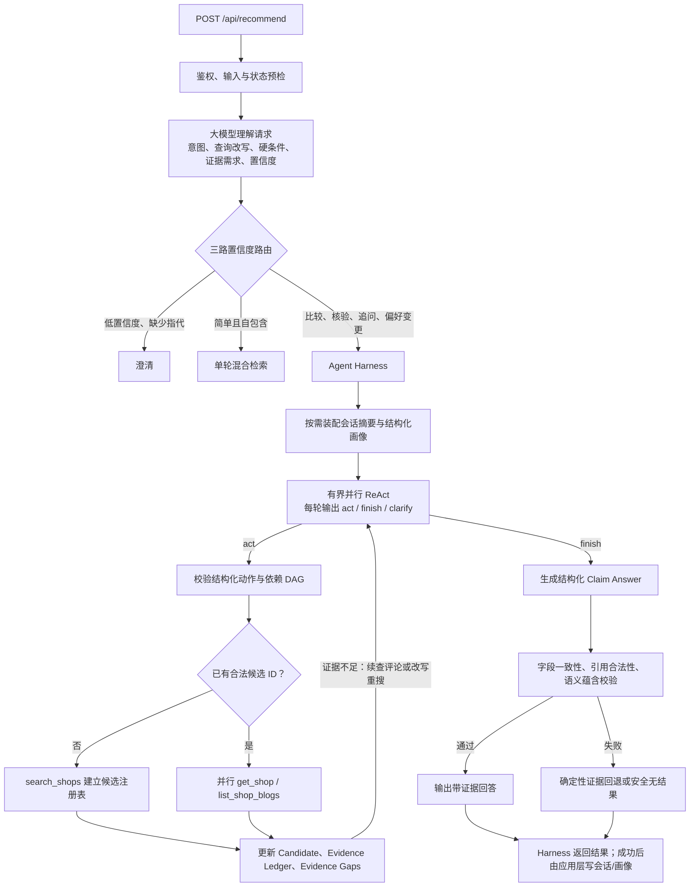

# Local Review Go

用 Go 实现的点评/电商后端，包含用户鉴权、店铺与博客、优惠券秒杀、缓存、消息队列、语义检索和推荐 Agent，并支持 Nginx 多实例部署。

**启动与测试**：详见 [doc/QUICKSTART.md](doc/QUICKSTART.md)。

---

## 一、AI 语义检索引擎 (RAG) 与推荐 Agent

> 暂未实现前端。这里的 ReAct 指有界“观察—行动”运行时，不是 React.js。RAG 演示：`make demo-rag`；多轮偏好演示：`make demo-agent`。说明见 [doc/AGENT_AND_EVAL.md](doc/AGENT_AND_EVAL.md)。

### 1.0 推荐入口

| 接口 | 说明 |
|------|------|
| `POST /api/rag/chat` | Hybrid RAG oneshot（SSE） |
| `POST /api/agent/recommend` | 有界多步 Agent（需登录；`force_route` 可选） |
| `POST /api/recommend` | 统一入口：`RecommendRouter` → RAG / Agent |

当前架构的端到端评测从生产 Router 入口开始，不强制指定 Agent 路由，也不运行对照组：

```bash
LLM_API_KEY='your-key' make docker-agent-e2e-v61
```

该命令实际执行“请求理解与改写 → 三路路由 → 澄清 / 单轮混合检索 / 有界并行 ReAct → 回答校验”，报告输出到 `rag-evals/reports/agent_e2e_v61.json`。

### 1.1 背景

传统关键词匹配无法理解「适合情侣的浪漫餐厅」等语义，引入向量检索 + LLM 实现智能推荐。

### 1.2 技术方案

- **统一检索存储**：PostgreSQL 17 + pgvector；`shop_search_documents` 同时持久化检索文本、384 维向量、模型名、内容哈希与来源版本
- **索引**：全文检索使用 `tsvector + GIN`，向量检索使用 pgvector HNSW（余弦距离），区域、类型、价格、评分和评论数使用组合过滤索引
- **一致性**：业务数据与检索文档处于同一数据库；RocketMQ 异步重建文档，并以 `source_version` 阻止旧消息覆盖新向量
- **Embedding**：默认 `local-feature-hash-zh-v2`（384 维确定性本地 embedding，便于离线复现）；也保留 OpenAI-compatible embedding provider 配置

### 1.3 检索流程

```
用户提问
    │
    ├─ 1. LLM 意图解析：提取 area、typeName、maxPrice、minScore 等 JSON
    ├─ 2. 确定性本地 embedding：问题转为 384 维向量
    ├─ 3. ShopSearchLogic：PostgreSQL 全文检索 + pgvector KNN，RRF 融合
    │       └─ 预过滤：area/type_name 等值 + 数值范围
    │       └─ 引号内精确店名优先，避免近邻分店挤掉目标
    │       └─ 语义阈值：MaxDistance 过滤 COSINE 距离过大的结果
    ├─ 4. 组装上下文：店铺信息 + 探店笔记（BlogRepo）
    └─ 5. LLM Chat：生成推荐，SSE 流式输出
```

### 1.4 数据同步

- **实时**：店铺创建/更新发 MQ → RAG 消费者 `NewShopUpdateRAGHandler` 异步 Embedding + `StoreShop`
- **离线**：`make seed-vector` 批量导入

### 1.5 当前 Agent 架构



当前实现不是“先生成完整计划，再从头执行”的静态工作流。动作控制器每轮只给出下一批有类型约束的动作；执行器返回观察后，运行时重新计算候选、证据缺口与剩余预算，再决定继续检索、翻页、改写重搜、澄清或结束。

生产路由只有 `rag_oneshot`、`agent`、`clarify` 三种。会话历史和长期偏好是 `agent` 内部按需装配的上下文，不是独立 Agent，也不是第四条路由。

| 层次 | 当前实现 |
|------|----------|
| Harness | 统一承担输入校验、上下文裁剪、运行时选择、预算/取消传递、事实校验和标准结果封装；自身不访问数据库，运行审计与画像提交留在应用层 |
| 请求理解 | 一次大模型结构化解析生成统一 `IntentSpec`，包含意图、路由、硬条件、软偏好、证据需求和 1～3 条改写；原问题始终保留为检索分支 |
| 三路路由 | 在 `rag_oneshot`、`agent`、`clarify` 间分流；模型异常时回退确定性规则，低置信度或缺失历史指代时优先澄清 |
| 动作控制器 | 只输出 `act / finish / clarify` 和短原因码，不暴露或持久化思维链；非法 JSON 或非法状态决策只允许一次有界修复 |
| 并行执行器 | 根据 `depends_on` 计算依赖图的就绪前沿，通过 `errgroup` 限流并行；支持单工具超时、瞬时错误重试、参数去重、失败依赖跳过和总调用预算 |
| 候选与证据账本 | `search_shops` 后才注册候选；详情与评价工具只能访问已注册 ID。评价通过服务端游标增量读取，默认每店最多两页 |
| 重排 | 混合检索形成第一阶段排序；工具执行后再按已验证证据覆盖率确定性重排 |
| 回答校验 | 最终回答先转为逐条声明 JSON，每条事实绑定 `shop:{id}.{field}` 或 `blog:{id}`；再做字段值、跨店引用、主观评价蕴含与硬条件校验，失败时关闭输出 |
| 运行安全 | 默认限制 4 轮、10 次工具调用、12 次尝试、2 次搜索和每店 2 页评价；无新证据、重复调用、超时和客户端取消都有显式终态 |

### 1.6 Agent 层面的主要改动

| 早期/兼容实现 | 当前 V2 |
|---------------|---------|
| 路由、RAG 过滤提取和 Agent 各自理解请求，容易出现意图不一致 | 统一 `IntentSpec` 同时服务路由、检索、证据收集和上下文策略 |
| 静态规划或顺序工具循环 | 有界并行 ReAct，每轮基于最新观察和证据缺口重新决策 |
| 模型可直接给详情/评价工具传任意店铺 ID | Candidate Registry 设置搜索屏障，未检索到的 ID 无法进入后续工具 |
| 一次读取评论后直接生成答案 | 评论证据不足时沿服务端 cursor 继续读取；无支持证据则明确返回无结果 |
| 只检查答案中的店铺 ID 是否出现过 | 逐条声明证据账本 + 字段一致性 + 语义蕴含校验，主观结论必须引用真实评价 |
| 将全部历史和画像直接拼入提示词 | Harness 只装配相关会话摘要和结构化画像；读取策略与“回答校验成功后写入”策略相互独立 |
| 请求日志难以还原一次运行 | Redis 检查点 + PostgreSQL 运行/工具审计 + OpenTelemetry 分层链路 |
| Agent 编排与业务落库混在一起 | Harness 只负责一次运行的安全边界，应用层负责路由、审计、会话和画像事务，便于离线回放与替换运行时 |

`AGENT_RUNTIME_VERSION=v1_plan` 仅用于回放旧规划基线；生产默认使用 `v2_react`。历史请求中的旧路由值只在入口兼容，内部立即归一为 `agent`，响应与新评测不再输出旧值。

### 1.7 并行执行、记忆与可观测性边界

- **为什么不能一开始并行查详情和评价**：`get_shop`、`list_shop_blogs` 的 `shop_id` 必须来自本轮 `search_shops`。第一轮先搜索；候选注册后，同一批候选的详情和评价才形成可并行的 DAG 就绪前沿。
- **如何继续检查评价**：每次评论工具返回服务端签发的 `next_cursor`。Evidence Gap 仍未满足且 cursor 非空时，下一轮 Controller 才能继续翻页；客户端或模型不能伪造偏移量。
- **长期偏好是否需要单独 Agent**：不需要。应用层从 PostgreSQL 加载版本化结构化画像、从 Redis 加载有界会话摘要，Harness 只注入与本轮有关的事实；显式偏好变更走确定性补丁，推断出的偏好只有在运行完成且回答通过校验后才以 CAS 更新。
- **运行恢复**：完整 `AgentState` 按 `run_id + revision` 写入 Redis checkpoint，使用事务 CAS 防止旧 revision 覆盖新状态，TTL 为 30 分钟；它与长期用户记忆分离。
- **执行追踪**：HTTP 上下文中的 W3C Trace ID 贯穿 `agent.run -> agent.controller / agent.action -> tool.execute`；SSE 的 `run_started`、最终响应和 PostgreSQL `agent_runs` 使用同一 `trace_id`。`agent_tool_calls` 仅保存参数摘要/哈希、状态、错误码、耗时和结果数，不保存原始问句或评价正文。
- **跨实例定位**：客户端先从 SSE 获得 trace id；Jaeger 按同一 id 展示跨 Nginx、Go 实例和工具 span，PostgreSQL 审计表补充运行终态、预算、Token、证据摘要和工具尝试，Redis 检查点用于故障恢复，三者职责不混用。

关键实现：

- 请求理解与查询改写：`internal/agent/understanding.go`
- 自适应三路路由：`internal/logic/adaptive_recommend_router.go`
- ReAct 状态机与预算：`internal/agent/react_runtime.go`、`internal/agent/react_types.go`
- Harness 边界：`internal/agent/harness.go`、`internal/agent/react_harness.go`
- DAG 并行执行：`internal/agent/react_executor.go`
- 证据缺口与逐条事实校验：`internal/agent/evidence_gap.go`、`internal/agent/claims.go`、`internal/agent/claim_entailment.go`
- 上下文、画像与运行审计编排：`internal/logic/recommend_agent_logic.go`

### 1.8 评测结果

评测使用固定种子生成的 200 家店和 1000 条评价；检索连接真实 PostgreSQL/pgvector，Agent 评测连接真实 DeepSeek API、PostgreSQL 与 Redis。v4 是旧工具循环的历史冻结结果；当前有界并行 ReAct 必须看 v6/v6.1 报告，不能沿用 v4 数字冒充新架构效果。

| 数据集 | 结果 |
|--------|------|
| Retrieval v2（60 题，固定过滤条件） | 任务成功率/HitRate@5 100%，Recall@5 81.6%，Precision@5 83.2%，MRR/NDCG@5 1.0，P50/P95 2/17 ms，基础设施错误率 0% |
| Retrieval v3 challenge（120 题） | HitRate@5 70.54%，task success 64.17%，no-result accuracy 12.50% |
| Agent v4（历史旧 runtime）与 one-shot Hybrid RAG 同任务对照 | scenario-macro task success 96.43% vs 46.43%；该数字不代表当前 V2 Agent |
| Router E2E v6.1 首轮诊断（修复前） | trial-micro task success 60.71%，scenario-macro 56.67%，成功任务 groundedness 97.06%，P50/P95 3.741s/13.849s，infra error 0% |
| Router E2E v6.1（当前 V2，本次实测） | 逐次任务成功率 92.86%、综合通过率 91.07%，场景宏平均任务成功率 90.00%，成功回答有据率 100%，P50/P95 7.208s/21.629s，56 次执行、基础设施错误率 0% |
| 三路 Router v2 challenge（52 题） | Accuracy 和 macro-F1 均为 100%；旧策略为 55.77% |

v6.1 通过真实生产入口执行“请求理解 → 三路路由 → 澄清/单轮检索/完整 Agent”，不强制路由，也不跑对照组。报告只说明固定数据集上的离线结果，不能外推为线上准确率。详细口径见 [Agent 与评测说明](doc/AGENT_AND_EVAL.md)。

---

## 二、分布式部署与基础设施

### 2.1 Nginx 负载均衡

- **配置**：`configs/nginx.conf`，upstream `go_backend` 指向 3 个 Go 实例
- **策略**：`least_conn` 最少连接
- **健康检查**：`/health` 端点，`max_fails=3`、`fail_timeout=30s` 被动健康检查，故障实例自动剔除
- **透传**：`X-Real-IP`、`X-Forwarded-For`、`Host` 等请求头透传

### 2.2 JWT 无状态认证

- **实现**：`internal/middleware/jwt.go`，`golang-jwt/jwt/v5`
- **Claims**：`CustomClaims` 含 `AuthUser`（id、nickName、icon）、`BufferTime`（缓冲期）、`RegisteredClaims`
- **Token 生命周期**：7 天有效，`TokenRefreshBuffer=30min` 内可刷新
- **多实例**：`JWT_SECRET_KEY` 通过 `env_file` 统一，保证各实例签发/校验一致
- **路由分组**：
  - `authGroup`：`middleware.AuthRequired()`，需登录
  - `publicGroup`：登录、验证码、热门博客等公开接口

---

## 三、高并发秒杀系统设计

### 3.1 整体流程

```
用户请求 POST /api/voucher-order/seckill/:id
    │
    ├─ 1. 令牌桶限流（中间件，超限 429）
    ├─ 2. 布隆过滤器校验 voucherId（不存在直接 404）
    ├─ 3. querySeckillVoucherById 查秒杀券
    ├─ 4. 校验秒杀时间（BeginTime/EndTime）
    ├─ 5. ensureSeckillStockInRedis（Redis 库存 key 存在则跳过，否则回填）
    ├─ 6. 发送 RocketMQ 事务消息（半消息）
    │       └─ ExecuteLocalTransaction：Lua 检查库存 + 防重复(SISMEMBER) + 预减
    │       └─ 成功 → Commit；失败 → Rollback
    ├─ 7. 立即返回「排队中」
    │
    └─ 消费者异步：lock:order:{userId} 分布式锁 → createVoucherOrder（HasPurchased + DecrStock + Create）
```

### 3.2 限流

- **秒杀接口**：`middleware.SeckillRateLimit()`，`golang.org/x/time/rate` 令牌桶，默认 1000 QPS、burst 2000，超限 429
- **登录/验证码**：按 IP 限流，`perIPRateLimit`，防暴力破解

### 3.3 Lua 脚本原子性

`script/voucher_script.lua` 在 Redis 内原子执行：

1. 检查 `seckill:stock:{voucherId}` 库存
2. 检查 `seckill:order:{voucherId}` 是否已含 userId（防重复）
3. `INCRBY stock -1`、`SADD order userId`

返回值：0 成功，1 库存不足/不存在，2 已购买。

**ensureSeckillStockInRedis 必要性**：Lua 要求 `seckill:stock:{voucherId}` 必须存在，否则直接返回 1 拒绝。key 可能因 Redis 重启、24h TTL 过期而缺失。该函数在 key 不存在时从 PostgreSQL 回填，保证业务可恢复；使用分布式锁 `lock:rebuild:stock:{voucherId}` 防止多实例并发回填。

### 3.4 RocketMQ 事务消息

- **流程**：半消息 → `ExecuteLocalTransaction` 执行 Lua → 成功 Commit / 失败 Rollback
- **回查**：Producer 崩溃时，Broker 调用 `CheckLocalTransaction`，根据 `seckill:order:{voucherId}` 是否含 userId 判断 Commit/Rollback
- **Topic**：`seckill-orders`，消费者组 `seckill-consumer-group`

### 3.5 PostgreSQL 乐观锁与唯一索引

- **DecrStock**：`UPDATE tb_seckill_voucher SET stock = stock - 1 WHERE voucher_id = ? AND stock > 0`，`stock > 0` 防止超卖
- **唯一索引**：`tb_voucher_order (user_id, voucher_id)` 兜底防重复下单
- **关单**：`UpdateStatus(id, NOTPAYED, CANCELED)` 条件更新，仅当状态为未支付时更新

### 3.6 订单超时处理

- **延迟消息**：下单时发送 `order-timeout` Topic，`DelayTimeLevel=16`（30 分钟）
- **消费者**：`HandleOrderTimeout` → `UpdateStatus` 关单 → PostgreSQL `IncrStock` 回滚库存 → Lua 恢复 Redis 库存 + `SREM` 移除用户购买标记

### 3.7 压测结果

k6 压测，1 Nginx + 3 Go 实例，151 用户 × 25 秒杀券：总 QPS ~1160，无超卖少卖。详见 [doc/LOAD_TEST.md](doc/LOAD_TEST.md)。

---

## 四、缓存架构与高可用保障

### 4.1 Redis Key 设计

`pkg/utils/redisx/keys.go` 集中管理：

| Key 模式 | 用途 |
|----------|------|
| `cache:shop:{id}` | 店铺详情缓存 |
| `seckill:stock:{voucherId}` | 秒杀库存 |
| `seckill:order:{voucherId}` | 用户购买标记（Set） |
| `cache:seckill:voucher:{id}` | 秒杀券缓存 |
| `shop:lock:{id}` | 店铺缓存重建锁 |
| `lock:order:{userId}` | 秒杀订单创建锁（消费者防同一用户并发） |
| `lock:rebuild:stock:{voucherId}` | 秒杀库存回填锁（防多实例并发回填） |
| `bf:shop`、`bf:seckill-voucher` | 布隆过滤器 |
| `uv:{date}` | UV 统计（HyperLogLog） |

### 4.2 布隆过滤器

- **实现**：`pkg/utils/BloomFilter.go`，基于 Redis BitMap
- **预热**：启动时异步从 DB 加载店铺 ID、秒杀券 ID，批量 `AddBatch` 写入
- **使用**：店铺详情 `QueryShopByIdWithCacheNull`、秒杀 `SeckillVoucher` 前先 `Contains`，不存在直接返回

### 4.3 店铺缓存策略

- **当前使用**：`QueryShopByIdPassThrough`，Cache Aside + 布隆过滤器防穿透 + 分布式锁防击穿（缓存 miss 时仅一个请求查 DB 重建）
- **逻辑过期**：`QueryShopByIdWithLogicExpire` 已实现，缓存存 `RedisData{Data, ExpireTime}`，无物理 TTL；过期时抢锁，抢到则投递 `redisDataQueue` 异步重建，抢不到返回旧数据

### 4.4 秒杀券缓存

- **Key**：`cache:seckill:voucher:{id}`，TTL 5 分钟
- **回填**：`querySeckillVoucherById` 未命中时查 DB 并写入
- **库存回填**：`seckill:stock` key 不存在时，`singleflight` 防并发回填，从 PostgreSQL 读取并 `SET`

### 4.5 分布式锁与 Watchdog

- **实现**：`pkg/utils/distributed_lock.go`
- **加锁**：`SET key token NX EX ttl`，成功则启动 Watchdog 协程
- **Watchdog**：每 `ttl/2` 执行 Lua 续期 `EXPIRE`，业务超时也不误删锁
- **解锁**：Lua 校验 token 后 `DEL`，保证仅持有者可释放

### 4.6 缓存一致性：MQ 异步删缓存

- **写路径**：`UpdateShopWithCache` → DB 更新 → 发 MQ `shop-update`（不同步删缓存）
- **消费者**：`shop-update-cache-consumer-group` 异步 `DEL cache:shop:{id}`
- **兜底**：MQ 发送失败时同步删缓存

### 4.7 店铺更新 MQ 双消费者

`shop-update` Topic 两个消费者组：

| 消费者组 | 职责 |
|----------|------|
| `shop-update-cache-consumer-group` | 异步删店铺缓存 |
| `shop-update-rag-consumer-group` | 异步生成检索文档，并更新 PostgreSQL 全文索引与向量 |

---

## 五、其他功能模块

### 5.1 UV 统计

- **实现**：`middleware/uv.go`，`UVStatisticsMiddleware`
- **存储**：Redis `PFADD uv:{yyyyMMdd} {visitor}`，HyperLogLog 去重
- **标识**：已登录用 userId，未登录用 `IP|UserAgent`

### 5.2 博客与关注

- **博客**：发布、点赞（`blog:like:{id}` Set）、关注流分页
- **关注**：`follow:{userId}` Set，共同关注用 `SINTER`


---

## 六、目录结构

```
local-review-go/
├── cmd/
│   ├── server/                   # 服务入口
│   ├── eval-rag/                 # Retrieval 评测
│   ├── eval-agent/               # Agent / 同任务 Hybrid 评测
│   └── generate-*/               # 固定种子数据与 golden 生成器
├── internal/
│   ├── agent/                    # 有界循环、工具、证据账本、事实校验
│   ├── config/                   # PostgreSQL、Redis、RocketMQ、OTel、env
│   ├── handler/                  # HTTP 与 SSE 接口
│   ├── logic/                    # 业务逻辑层
│   ├── memory/                   # 结构化画像与有界会话上下文
│   ├── rag/                      # 检索文档构建
│   ├── repository/               # 数据访问（含 interface/）
│   ├── model/                    # GORM 实体
│   ├── middleware/               # JWT、UV、限流
│   ├── mq/                       # RocketMQ 生产者/消费者（秒杀、订单超时、店铺更新）
│   └── llm/                      # Embedding、Chat 客户端
├── pkg/
│   ├── httpx/                    # Result[T]、Ok/Fail、BindJSON
│   └── utils/                    # BloomFilter、DistributedLock、redisx
├── configs/nginx.conf            # Nginx 负载均衡
├── rag-evals/                     # 版本化数据集、golden 与正式报告
├── script/                        # Lua、seed、Demo、冒烟和压测脚本
└── doc/                           # 使用说明与技术文档
```

压测方式与报告见 [doc/LOAD_TEST.md](doc/LOAD_TEST.md)。
