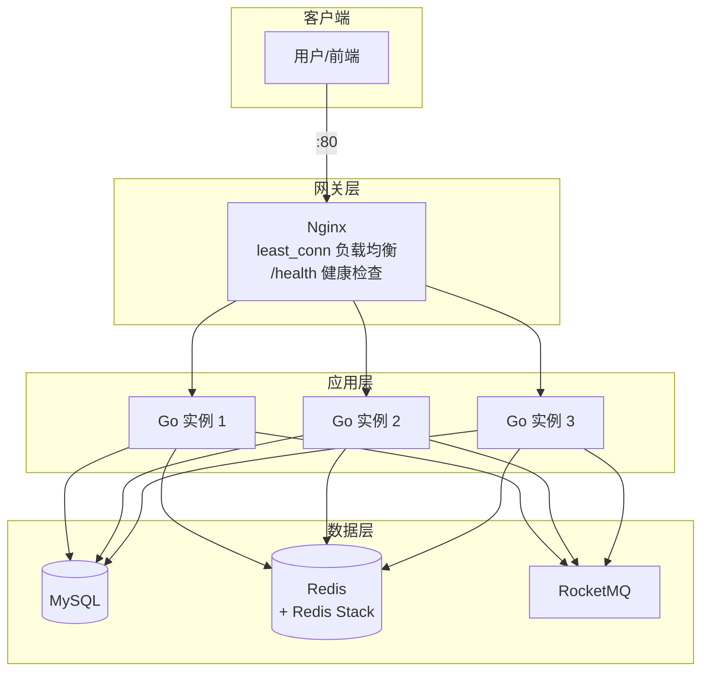
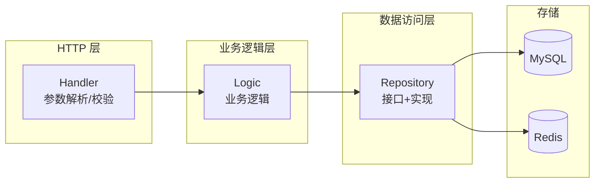
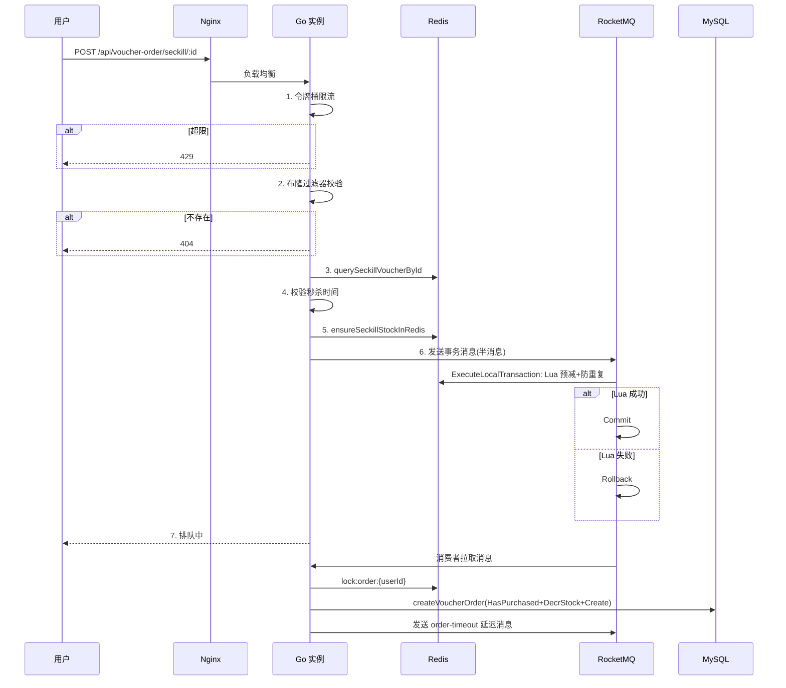
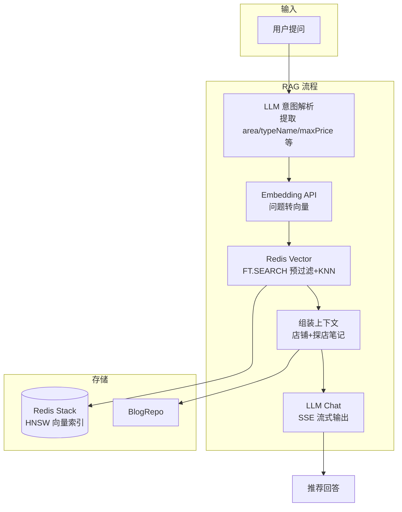
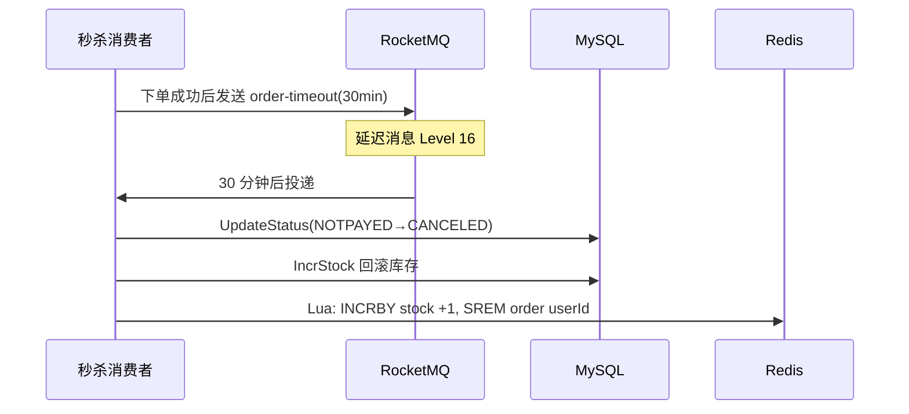

# 架构图 (Mermaid)

## 核心组件

| 层级 | 组件 | 说明 |
|------|------|------|
| **流量入口** | Nginx | 反向代理与负载均衡，upstream `go_backend` 指向 3 个 Go 实例，`least_conn` 策略 |
| **应用服务** | Go Cluster | 基于 Gin 框架，Handler → Logic → Repository 分层 |
| | Handler | HTTP 请求处理、参数校验、返回 `httpx.Result` |
| | Logic | 业务逻辑（秒杀资格、RAG 检索等） |
| | Repository | 接口与实现，操作 Redis / MySQL |
| **数据存储** | MySQL | 用户、店铺、优惠券、博客等关系型数据 |
| | Redis Stack | 缓存（店铺详情、分布式锁）、向量索引 `vec:shop`（RAG） |
| **消息队列** | RocketMQ | `seckill-orders` 削峰异步落库；`shop-update` 异步删缓存/更新向量；`order-timeout` 延迟关单 |
| **外部服务** | LLM API | DeepSeek/智谱等，RAG 意图解析与内容生成 |

## 关键数据流向

| 场景 | 链路 |
|------|------|
| **常规 REST** | Client → Nginx → Handler → Logic → Repository → Redis（缓存）/ MySQL |
| **秒杀** | Client → Nginx → Handler → Redis（Lua 预减+防重）→ RocketMQ → Consumer → MySQL |
| **RAG** | Client → Handler → LLM（意图解析）→ Redis（向量检索）→ LLM（生成）→ Client |

---

## 1. 系统部署架构



## 2. 应用分层架构



## 3. 秒杀流程时序图



## 4. 店铺更新与缓存一致性

```mermaid
flowchart LR
    subgraph Write["写路径"]
        A[UpdateShop] --> B[DB 更新]
        B --> C[发 MQ shop-update]
    end

    subgraph MQ["RocketMQ"]
        Topic[shop-update Topic]
    end

    subgraph Consumer1["消费者组 1"]
        C1[shop-update-cache-consumer-group]
        C1 --> D1[DEL cache:shop:{id}]
    end

    subgraph Consumer2["消费者组 2"]
        C2[shop-update-rag-consumer-group]
        C2 --> D2[Embedding + StoreShop 向量]
    end

    C --> Topic
    Topic --> C1
    Topic --> C2
```

## 5. RAG 智能点评流程



## 6. 订单超时关单流程


